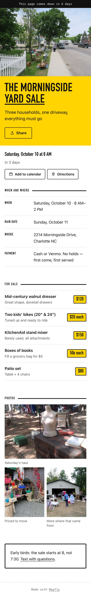
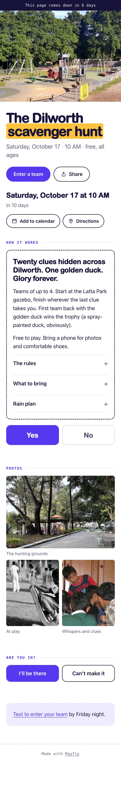

# Mayfly

One-page websites with an end date. People describe what they need in a chat
at **https://trymayfly.com/start**, pick how long the page stays up, and get a
link at `name.trymayfly.com`. When the time runs out, the page and its photos
are deleted.

<p>




</p>

## How it fits together

- **Worker** (`worker/mayfly-router.js`). A single Cloudflare Worker with no
  dependencies. It serves the landing page, the chat, and every customer site,
  runs the intake API and its moderation (Llama Guard, a house-policy check,
  and vision screening on photos), and deletes expired sites once a day.
- **Chat** (`site/start.html`). Nova, on Workers AI, collects each design's
  required facts. The worker decides when an order is complete, so the model
  can't end the interview early. Photos are shrunk and stripped of location
  data on the phone before upload. Paid orders get a Stripe link tagged with
  the order id (`client_reference_id`).
- **Orders** land in KV as `order:<id>` with their status in key metadata.
  A person reviews and builds every page; nothing publishes on its own.
- **Themes** (`site/themes/`). Eight designs: celebrate, invite, announce,
  sell, remember, rally, inform, play. They share a base stylesheet and widget
  script (`_widgets.html`: calendar file, directions, RSVP by text or email,
  share, photo viewer, expiry badge) copied in by `scripts/inject-widgets.py`.
  All type is system fonts, so pages load with no font downloads.
- **Analytics** are cookieless and account-free (Workers Analytics Engine).
  No IP addresses or user IDs are stored; unique visitors use a hash that
  changes every day. `scripts/stats.py` prints the funnel, top pages, orders,
  and referrers.

## Security and privacy

- Strict security headers everywhere. Customer pages get a CSP that blocks
  third-party scripts, outbound requests, forms, and framing.
- Customer pages are `noindex` so addresses and phone numbers stay out of
  search engines (the pinned examples are indexable).
- Uploaded and published images are checked by their bytes, not the declared
  type, and are only ever served as images.
- Rate limits use the edge cache, not KV, so they don't spend the free plan's
  1,000 KV writes a day.

## Working on it

```bash
npm test                       # worker tests (Node 20+, no installs)
npm run dev                    # http://localhost:8787 with fake KV and a scripted Nova
python3 scripts/render-demos.py    # build the 8 examples into demos/ (+ screenshots)
python3 scripts/inject-widgets.py  # after editing site/themes/_widgets.html
```

Python scripts need Pillow (`pip install -r requirements.txt`).

## Operating it

| Task | Command |
|---|---|
| Deploy worker, pages, images | `worker/deploy-mayfly.py` (`--pages-only` for just the HTML and images) |
| Publish a customer site | `scripts/build-site.py --theme sell --sub yard-sale --ttl-days 7 --tier week --title "..." --vars vars.json --images photos/` |
| Preview before publishing | add `--out /tmp/page.html` |
| Publish a permanent example | add `--pin` |
| See pending orders | `GET /api/orders/pending` (admin token) |
| Mark an order paid or built | `PATCH /api/orders/<id>` with `{"status": "paid"}` |
| Traffic and orders | `scripts/stats.py --days 30` |
| Rebuild landing images | `scripts/build-landing-images.py` |

Credentials: the scripts use the hatch VM's credential helper when it's
present, otherwise `CLOUDFLARE_API_TOKEN`. The admin token and KV id live in
`hidden_files/mayfly.env`, which is git-ignored; copy it from secure storage.

## Pricing

Free for 1 day · $1 for 2 days · $1.50 for 7 days · $5 for 30 days · $50 for a year.

## Layout

- `worker/`: the Worker, its deploy script, and domain setup
- `site/`: landing page, chat page, themes, landing images (`img/`, sources and credits in `img-src/`)
- `scripts/`: publisher, widget injector, stats, demo renderer
- `examples/`: vars and photos for the eight permanent example sites
- `demos/`: phone screenshots of the examples
- `test/`: worker tests and the local dev server
- `hidden_files/`: ops playbook (internal)
